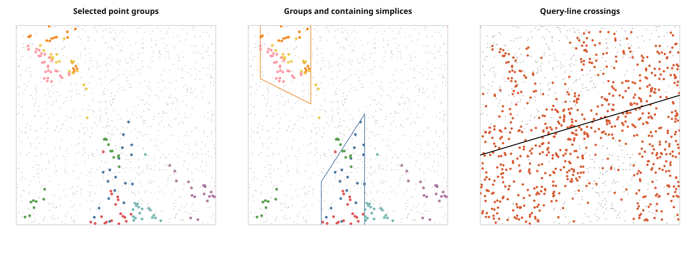
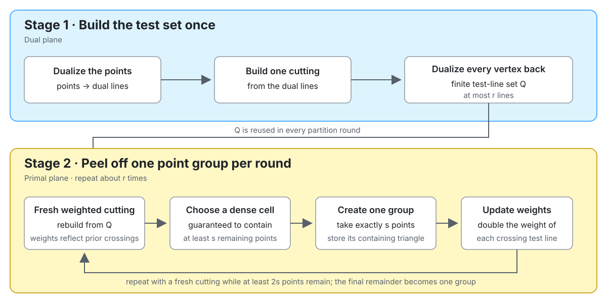
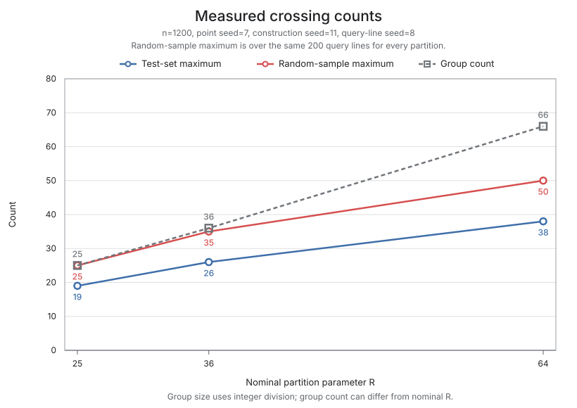

# Matoušek Partition Tree — verified proof-skeleton implementation

[](https://github.com/wangyi1010/matousek-partition-tree-cpp/actions/workflows/ci.yml)

A working, runtime-verified proof skeleton of the 2D **Partition Theorem**
(Matoušek 1992) for halfplane range counting — an algorithm that is optimal
on paper and, as far as I can tell, has **no existing library implementation
anywhere**. This project implements the actual proof machinery (point-line
duality, weighted cuttings, exponential reweighting), verifies every
enforceable precondition at runtime, and **measures the constants** that
explain why theory-optimal never shipped.

The C++20 implementation uses exact rational coordinates and geometric predicates
through `boost::rational<boost::multiprecision::cpp_int>`.
Irrational scale choices involving square roots are represented by bounded
floating-point control parameters; they never replace exact orientation,
containment, intersection, or halfplane predicates.



*n = 1200 points, r = 64: the construction produces 66 disjoint point groups
of sizes in [18, 36). The left panel highlights 8 representative groups, the
middle panel shows the same groups inside their containing — possibly
overlapping — simplices, and the right panel shows which groups a halfplane
query must recurse into versus count wholesale in $`O(1)`$.*

## Quick start

CMake 3.20+, a C++20 compiler, and Boost headers are required. Boost is used
header-only; the library has no runtime dependencies.

```bash
cmake -S . -B build -DCMAKE_BUILD_TYPE=Release
cmake --build build --parallel

# proof-skeleton demo: build at r=64, verify 60 queries vs brute force,
# print measured crossing numbers (~20 s)
./build/matousek-demo 1200 42

# property tests
ctest --test-dir build --output-on-failure

# reproduce the crossing-constants table in "Measured results" below
./build/measure-crossings 1200 7

# measure construction and exact-query performance; every query is first
# checked against brute force, and results can be exported as JSON
./build/measure-performance --json performance.json

# regenerate the figure above
./build/matousek-visualize 1200 42 assets/partition_tree_example.svg
```

## How the construction works

The build has **two stages**. Stage 1 creates the finite test set $`Q`$ once.
Stage 2 reuses $`Q`$ while removing one point group per round. The important
detail is that every round builds a **fresh** weighted cutting rather than
walking over cells from a previous round.



The diagram omits one control parameter: each round uses cutting scale
$`t_i = 0.35\sqrt{n_i/s}`$, which decreases with the remaining point count.
The complexity section below explains why reweighting controls the number of
crossed groups.

## Measured results and limitations

The theorem's asymptotic target is a partition into roughly $`r`$ simplices
such that every line crosses at most $`O(\sqrt r)`$ of them. This implementation
checks the construction's enforceable preconditions, but finite experiments do
not prove that all-lines asymptotic statement. The measurements below are tied
to their stated inputs and construction parameters.

### Default-scale baseline: 1,200 points

The baseline uses 1,200 points (point seed 7), a common successful construction
seed of 11, and the same 200 query lines (seed 8) for every partition.
`./build/measure-crossings` reproduces this table. Exact rational arithmetic
remains substantially slower than floating-point geometry.

| nominal $`R`$ | group size $`s`$ | actual $`n/s`$ | groups | $`\lvert Q\rvert`$ | $`K_Q`$ (test lines) | max over 200 sampled lines |
|---|---:|---:|---:|---:|---:|---:|
| 25 | 48 | 25.00 | 25 | 15 | 19 | 25 |
| 36 | 33 | 36.36 | 36 | 33 | 27 | 32 |
| 64 | 18 | 66.67 | 66 | 55 | 39 | 51 |

The horizontal axis is the requested partition parameter $`R`$. Because the
implementation uses integer group size $`s=\lfloor n/R\rfloor`$, the resulting
group count can differ from $`R`$. “Random-sample maximum” is an empirical
maximum over the stated 200 lines, not a worst-case maximum over all lines.



> This chart compares only the controlled 1,200-point runs. The 10,000-point
> diagnostic below is excluded because it uses a different cutting scale
> (0.20 instead of 0.35) and is therefore not directly comparable.

These three runs show the finite test-set mechanism working: the normalized
ratios $`K_Q/\sqrt{\text{groups}}`$ are about 3.8–4.8. Three points do not
establish an asymptotic rate, and the maximum over 200 sampled lines is not an
all-lines maximum. The Test Set Lemma contributes additional constants and an
$`O(\sqrt r)`$ term. Consequently, $`3K_Q+\sqrt r`$ is used here only as a
normalized illustration, not as the exact theorem guarantee for this program.

### High-group diagnostic: 10,000 points

**This is a stress diagnostic, not a faster configuration and not a point on
the scaling curve above.** It exists to show the verification machinery holding
up at 200 groups, and to report honestly what happens to the constants there.

The run uses 10,000 exact rational points, nominal $`R=200`$, group
size $`s=50`$, and 200 resulting groups. The default cutting scale of 0.35 could
not satisfy the verified face budget for this instance, so this run uses the
smaller fixed scale 0.20. Every cutting condition remains checked; the tradeoff
is a weaker measured crossing constant. The test-set maximum is 119, and the
displayed query line crosses 114 of the 200 simplices.

This configuration is not directly comparable with the default-scale baseline:
the
normalized illustrative value $`3(119)+\sqrt{200}\approx371`$ still exceeds the
200 groups, so even this high-group run remains vacuous at one level under that
illustration.


```bash
./build/matousek-visualize 10000 42 assets/partition_tree_10000.svg 200 0.20
```

On the machine used to generate the committed figure, the exact construction
took 287 seconds and peaked at about 17 MB of resident memory. The exact
conservative arrangement bound avoids materializing all pairwise intersections.

The crossing experiment is complemented by
`measure-performance`, which validates every timed query against
brute force before reporting construction time, exact-query latency,
brute-force latency, and their ratio. It can also write JSON for reproducible
comparisons. Timings are intentionally not hard-coded here because they depend
on the compiler, build mode, and machine.

## Complexity calculation

The whole chain, in one place. This is the calculation behind the query bound.

| Symbol | Meaning |
|---|---|
| $`n`$ | number of input points at the current tree node |
| $`s`$ | target size of each point group |
| $`r=n/s`$ | intended number of groups in one partition step |
| $`\Pi`$ | the simplicial partition: point groups plus their containing triangles |
| $`h`$ | an arbitrary query line, i.e. the boundary of a halfplane query |
| $`\mathrm{cr}_\Pi(h)`$ | number of triangles of $`\Pi`$ crossed by line $`h`$ |
| $`Q`$ | finite set of test lines built from dual cutting vertices |
| $`K_Q`$ | worst crossing count among the test lines in $`Q`$ |
| $`T(n)`$ | query time for a subtree containing $`n`$ points |

**Setup.** At one tree node, choose group size $`s`$. Then the intended number
of groups is:

$$r=\frac{n}{s}.$$

The finite test set is constructed so that:

$$|Q|\le r.$$

**Step 1: control only the finite test set.** Exponential reweighting bounds
how many triangles any test line crosses:

$$K_Q = O(\sqrt r).$$

**Step 2: transfer from test lines to every line.** The Test Set Lemma says
that any query line $`h`$ is controlled by three nearby test lines, plus one
extra error term:

$$\mathrm{cr}_\Pi(h) \le 3K_Q + O\left(\frac{n}{s\sqrt r}\right).$$

Here:

- $`3K_Q`$ comes from the three vertices of a dual cutting triangle.
- $`O(n/(s\sqrt r))`$ counts the possible bad simplices not already covered by those three test lines.

**Step 3: simplify the error term.** Since $`r=n/s`$, we get:

$$\frac{n}{s\sqrt r}=\frac{r}{\sqrt r}=\sqrt r.$$

Therefore:

$$\mathrm{cr}_\Pi(h)=O(\sqrt r).$$

So *every* line — not just test lines — crosses $`O(\sqrt r)`$ of the $`r`$ simplices.

**Step 4: turn crossing number into query time.** A halfplane query recurses
only into crossed triangles. The other groups are fully inside or outside the
query halfplane and are counted or discarded wholesale. This gives:

$$T(n) = r + O(\sqrt r)\,T(2n/r).$$

In this recurrence:

- $`r`$ is the work to inspect the groups at the current node.
- $`O(\sqrt r)`$ is the number of children the query may recurse into.
- $`2n/r`$ is the maximum child size, because each group has fewer than $`2n/r`$ points.

Choosing $`r`$ as a sufficiently large constant depending on $`\varepsilon`$
solves the recurrence to:

$$T(n)=O\left(n^{1/2+\varepsilon}\right).$$

the theorem's optimal query time. The measured table above is exactly the
$`K_Q = O(\sqrt r)`$ step, with its constant of ≈ 4–5 made explicit.

### Theoretical preprocessing time

Separate from the query recurrence: the theorem builds the whole tree in
$`O(n\log n)`$ time. A simpler level-by-level argument gives the weaker
$`O(n^{1+\varepsilon})`$ — each depth of the recursion costs a constant factor
less than the one above it, because the child classes are disjoint and each is
at most $`2n/r`$ in size, so for fixed $`r>2`$:

$$\left(\tfrac{2}{r}\right)^{\delta}<1 \;\Longrightarrow\; \sum_{j\ge0}\left(\tfrac{2}{r}\right)^{j\delta}=O(1) \;\Longrightarrow\; B(n)=O\left(n^{1+\delta}\right).$$

This is a theorem-level bound, **not** a proved wall-clock bound for this
implementation — exact arbitrary-precision rational arithmetic and randomized cutting retries make
it far slower in practice. Full level-by-level derivation:
[`docs/two_dimensional_partition_theorem_math.md`](docs/two_dimensional_partition_theorem_math.md#preprocessing-time-building-the-partition-tree).

## What "verified" means here

Every precondition of the construction that can be checked at runtime is
checked, and violations raise instead of degrading silently:

- **Weighted cuttings** are built by the two-level Chazelle–Friedman scheme
  (coarse $`\sim t`$-line sample, then refinement of heavy cells only — a naive
  $`t\log t`$ sample provably cannot satisfy the $`O(t^2)`$ face budget) and are
  **verified** against both cutting conditions: per-cell crossing weight
  $`\le W/t`$, and face count within the pigeonhole budget $`n_i/s`$. Unverifiable
  cuttings raise `CuttingError`.
- **The test set Q** is the dual of *all* vertices of a fixed-scale
  $`(1/(\beta\sqrt r))`$-cutting of $`P^*`$, $`\beta=0.25`$ fixed. If the cutting has more than $`r`$
  vertices, the code raises `TestSetError` rather than shrinking the cutting
  scale (which would silently invalidate the Test Set Lemma's $`O(n/(s\sqrt r))`$
  conflict bound).
- **Pigeonhole is an assert, not a search**: the face budget guarantees a
  face with $`\ge s`$ remaining points exists.
- **All geometric coordinates and predicates use exact rational arithmetic**
  (`boost::rational<boost::multiprecision::cpp_int>`); square-root-derived cutting scales remain control
  parameters rather than geometric coordinates;
  boundary contacts follow a general-position convention used consistently
  in construction and verification.
- **Queries are exact** and tested against brute force (CI runs this on
  every push).
- **Tests are automated** with CTest and GitHub Actions. They cover
  partition postconditions, cutting postconditions, exact duality, boundary
  queries, multiple random seeds, expected failure behavior, and query
  equivalence against brute force.

The verification discipline caught real bugs during development: a crossing
convention that made the cutting condition unsatisfiable, a naive sampling
scheme that deadlocked against the face budget, and an adaptive β that
quietly destroyed the theorem's cutting scale.

## What this is not

- **Not a certified implementation of the theorem.** Cuttings are built in a
  bounding box that contains the arrangement's full combinatorial structure,
  not the projective plane; the construction is Las Vegas and may raise for
  small r or unlucky seeds; $`\beta\sqrt r\le 1`$ ($`r<16`$) degenerates the test-set
  cutting to a trivial box — the regime where the bound is vacuous anyway.
- **Not a machine-checked proof of the Test Set Lemma.** The repository
  implements its construction and contains the mathematical derivation, while
  experiments can inspect only finitely many query lines.
- **Not a production spatial index.** This is the faithful theorem — exact
  arithmetic, verified cuttings — built to be correct and measurable, not fast.
  Production systems use R-trees / kd-trees with no adversarial guarantee
  instead; the measurements above quantify why.

## Repository layout

| Path | What |
|---|---|
| `include/matousek_partition_tree/core.hpp` | public C++ API and exact geometry types |
| `src/core.cpp` | verified construction, partition tree, and halfplane queries |
| `apps/demo.cpp` | `matousek-demo` command-line program |
| `apps/visualize.cpp` | dependency-free SVG partition visualizer |
| `benchmarks/measure_crossings.cpp` | K_Q / crossing-number measurement (the table above) |
| `benchmarks/measure_performance.cpp` | validated construction/query timings, brute-force comparison, and JSON output |
| `tests/` | automated property tests: partition validity, sizes in [s, 2s), simplex containment, cutting conditions, duality, boundary cases, multi-seed exact-query equivalence |
| `docs/` | self-contained math derivation of the 2D theorem, as GitHub-rendered Markdown plus a typeset PDF (Helvetica Neue / STIX Two Math) built with pandoc + XeLaTeX |

## Full derivation

The complete proof — duality, the Test Set Lemma, the weight recurrence, the
$`K_Q=O(\log\lvert Q\rvert+\sqrt r)`$ bound, and preprocessing time — with every
step written out:
[`docs/two_dimensional_partition_theorem_math.md`](docs/two_dimensional_partition_theorem_math.md).

## Citation

Jiří Matoušek, **Efficient Partition Trees**, *Discrete & Computational
Geometry* 8, 315–334, 1992.

Bernard Chazelle, Joel Friedman, **A deterministic view of random sampling
and its use in geometry**, *Combinatorica* 10, 229–249, 1990 (the two-level
cutting construction).
