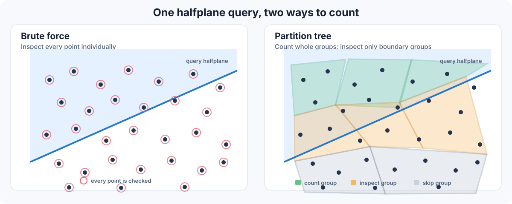

# Matoušek Partition Tree

[](https://github.com/wangyi1010/matousek-partition-tree-cpp/actions/workflows/ci.yml)
[](https://en.cppreference.com/w/cpp/20)
[](LICENSE)

A C++20 research implementation of Matoušek's two-dimensional partition tree
for exact halfplane range counting.

## 1. The problem

Given a fixed set of points in the plane, preprocess them once so that each new
halfplane query can quickly answer one question:

> How many input points lie inside this halfplane?

The query supplies a boundary line and the side of that line to keep; this
selected halfplane is the target region.

A brute-force query checks every point. A partition tree instead counts whole
groups when possible and examines only the groups crossed by the query
boundary.

## 2. The algorithm

### Core idea

At a node with $n$ points, choose a fixed branching factor $r$. Construct about
$r$ child groups, each containing about $n / r$ points, and assign each group a
containing triangle. Recursively apply the same rule to every child group.

The key theorem guarantee is that every line crosses only $O(\sqrt r)$ of the
child triangles. Therefore a halfplane query continues into only $O(\sqrt r)$
children, even though the node has about $r$ children.

Each crossed child contains at most $2n / r$ points. A triangle wholly inside
the halfplane contributes its cached count; a wholly outside triangle is
skipped.

This gives the recurrence

$$T(n) = O(r) + O(\sqrt r)\,T\left(\frac{2n}{r}\right).$$

and, for a sufficiently large fixed $r$, the theoretical query bound
$O\left(n^{1/2+\varepsilon}\right)$.

The duality, finite test set, weighted cuttings, and exponential reweighting
in this repository are the machinery used to prove the key line-crossing
guarantee.

1. Convert the input points into lines using point-line duality.
2. Build a verified weighted cutting and derive a finite test set.
3. Use exponential reweighting to extract small point groups contained in
   triangles.
4. Recurse on those groups to build the partition tree.
5. For each query, count groups fully inside, skip groups fully outside, and
   recurse only into crossed groups.

[Read the detailed mathematical construction flow →](docs/two_dimensional_partition_theorem_math.md#step-1-build-the-finite-test-set-q)

## 3. Complexity

For any fixed positive slack parameter, the partition theorem gives the
theoretical query bound

$$T_{\mathrm{query}}(n) = O\left(n^{1/2+\varepsilon}\right).$$

Matoušek's tighter theorem-level preprocessing result is

$$T_{\mathrm{build}}(n) = O(n\log n).$$

The direct level-by-level construction analysis documented in this repository
instead gives

$$T_{\mathrm{build}}(n) = O\left(n^{1+\delta}\right).$$

for any fixed positive slack parameter. These are asymptotic theorem-level
bounds, not measured wall-clock guarantees for this implementation. Exact
arbitrary-precision arithmetic and randomized cutting retries add costs not
covered by those statements. Query answers themselves are exact; the slack
parameters do not represent approximation error.

[Read the complete mathematical derivation →](docs/two_dimensional_partition_theorem_math.md)

## 4. Visual example



The left panel scans every point. The right panel counts complete groups,
rejects groups outside the halfplane, and inspects only crossed groups.

## Status and scope

This is a proof-faithful, runtime-verified research implementation. It is
intended for studying the construction, checking its enforceable conditions,
and measuring its finite constants. It is not presented as a production
spatial index or a machine-checked proof.

- Geometric coordinates and predicates use exact
  `boost::rational<boost::multiprecision::cpp_int>` arithmetic.
- Floating point is limited to randomized cutting control parameters, SVG
  output, and timing measurements.
- Construction is randomized and seedable. It either returns a structure that
  passes its runtime checks or raises `CuttingError` or `TestSetError`.
- Halfplane membership includes boundary points.

## Requirements

- CMake 3.20 or newer.
- A C++20 compiler.
- Boost headers. Boost is used header-only; the built library has no runtime
  Boost dependency.

CI builds and tests the project with GCC and Clang on Ubuntu and with Clang on
macOS.

## Build, test, and run

```bash
git clone https://github.com/wangyi1010/matousek-partition-tree-cpp.git
cd matousek-partition-tree-cpp

cmake -S . -B build -DCMAKE_BUILD_TYPE=Release
cmake --build build --parallel
ctest --test-dir build --output-on-failure

# Build a tree and compare 60 exact queries with brute force.
./build/matousek-demo 400 42

# Generate an SVG visualization.
./build/matousek-visualize 1200 42 partition.svg
```

Tests and benchmarks can be disabled independently when configuring:

```bash
cmake -S . -B build \
  -DMPT_BUILD_TESTS=OFF \
  -DMPT_BUILD_BENCHMARKS=OFF
```

## Library usage

The public API is declared in
[`include/matousek_partition_tree/core.hpp`](include/matousek_partition_tree/core.hpp).

```cpp
#include <matousek_partition_tree/core.hpp>

#include <cstddef>
#include <vector>

int main() {
    using mpt::rational;

    const std::vector<mpt::Point> points{
        {rational(0), rational(0)},
        {rational(2), rational(0)},
        {rational(0), rational(2)},
        {rational(2), rational(2)},
    };

    const auto tree = mpt::build_tree(points, 8, 32, 42);
    const mpt::Halfplane query{rational(1), rational(0), rational(-1)};
    const std::size_t count = mpt::query_count(*tree, query);

    return count == 2 ? 0 : 1;
}
```

Install and consume the exported CMake target with:

```bash
cmake --install build --prefix "$PWD/install"
```

```cmake
find_package(MatousekPartitionTree CONFIG REQUIRED)
target_link_libraries(your_target PRIVATE
    MatousekPartitionTree::matousek_partition_tree)
```

Add the chosen install prefix to `CMAKE_PREFIX_PATH` when configuring the
consuming project.

## Correctness and verification

The project checks correctness at three levels:

- Property tests cover exact duality, boundary and axis-aligned halfplanes,
  group sizes, simplex containment, cutting postconditions, multiple random
  seeds, and expected construction failures.
- Query tests compare partition-tree counts with brute-force counts.
- The demo and performance benchmark also refuse to succeed if any query
  differs from brute force.

GitHub Actions runs the build, CTest suite, demo smoke test, and benchmark smoke
test on every push and pull request. “Verified” means that enforceable runtime
conditions are checked; it does not mean the full mathematical theorem has
been formally verified by a proof assistant.

## Reproducible measurements

Measure construction time, query latency, brute-force latency, speedup, and
exact agreement:

```bash
./build/measure-performance \
  --sizes 200 400 800 \
  --queries 100 \
  --repeats 3 \
  --seed 7 \
  --json performance.json
```

Every timed partition-tree query is checked against brute force before results
are reported. Timings are intentionally not hard-coded here because they depend
on the compiler, build mode, and machine.

Reproduce the deterministic 1,200-point crossing experiment:

```bash
./build/measure-crossings 1200 7 --plot crossing_scaling.svg
```

| Nominal partition parameter | Group size | Groups | Test-set lines | Test-set maximum | Maximum over 200 sampled lines |
|---:|---:|---:|---:|---:|---:|
| 25 | 48 | 25 | 15 | 19 | 25 |
| 36 | 33 | 36 | 33 | 26 | 35 |
| 64 | 18 | 66 | 55 | 38 | 50 |

The table is finite experimental evidence, not a proof of the all-lines
asymptotic bound. The sampled maximum uses the same 200 deterministic query
lines for every row. The nominal partition parameter can differ from the final
group count because group sizes use integer division. The existing
[scaling chart](assets/crossing_scaling.svg) records the same experiment.

## Limitations

- Exact arbitrary-precision rational geometry is substantially slower than
  floating-point spatial indexes.
- The Las Vegas construction can retry or raise for difficult parameter and
  seed combinations; it never silently weakens a verification condition.
- The cutting is constructed inside a conservative bounding box rather than a
  certified projective-plane implementation.
- Finite tests cannot prove the Test Set Lemma or an asymptotic guarantee over
  every possible query line.
- The repository prioritizes correspondence with the geometric proof over
  production throughput. R-trees and kd-trees are usually more practical when
  adversarial partition-tree guarantees are not required.

## Repository guide

| Path | Purpose |
|---|---|
| [`include/matousek_partition_tree/core.hpp`](include/matousek_partition_tree/core.hpp) | Public C++ API and exact geometry types |
| [`src/core.cpp`](src/core.cpp) | Verified construction, tree building, and queries |
| [`apps/demo.cpp`](apps/demo.cpp) | End-to-end demo with brute-force validation |
| [`apps/visualize.cpp`](apps/visualize.cpp) | Dependency-free SVG visualizer |
| [`benchmarks/measure_crossings.cpp`](benchmarks/measure_crossings.cpp) | Crossing-number experiment and scaling plot |
| [`benchmarks/measure_performance.cpp`](benchmarks/measure_performance.cpp) | Validated query benchmark and JSON export |
| [`tests/`](tests) | Property and exact-query tests |
| [`docs/`](docs) | Mathematical derivation in Markdown, TeX, and PDF |

Additional project information:

- [Mathematical derivation](docs/two_dimensional_partition_theorem_math.md)
- [Typeset derivation](docs/two_dimensional_partition_theorem_math.pdf)
- [Contributing guide](CONTRIBUTING.md)
- [Changelog](CHANGELOG.md)

## References

- Jiří Matoušek, “Efficient Partition Trees,” *Discrete & Computational
  Geometry* 8, 315–334, 1992.
- Bernard Chazelle and Joel Friedman, “A deterministic view of random sampling
  and its use in geometry,” *Combinatorica* 10, 229–249, 1990.

## License

Released under the [MIT License](LICENSE).
